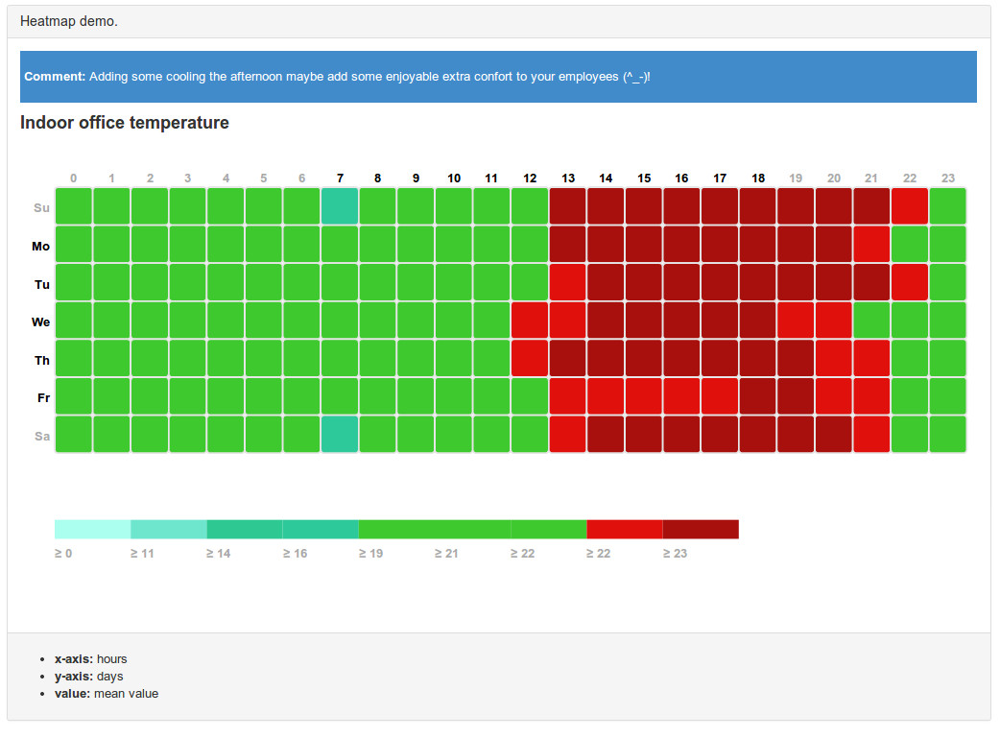

jquery-widget-heatmap
======================

heatmap widget for JQuery

A propos
--------------

My primaraly goal was to develop a widget as much as possible independant from his own data source.
Todo so I chose to develop this widget with the widget factory provided by JQuery UI and I had my own logic to get binded with a proxy in charge to notify the widget with the dataset loading.
The proxy is passed in parameter of the widget when you configure it. In this version I used d3.js to proxy a csv data files.

This plugin is still in the early stage of his development. So it's furnished for testing purpose only.

You can find more advanced implementation there:
[Heatmap JS](http://www.patrick-wied.at/static/heatmapjs/)

The rendering is based on this source code:
[Heatmap with d3.js](http://bl.ocks.org/tjdecke/5558084)

Usage
--------------
Here the proxy function name is: controlCSVHistorique.
The proxy is called by the widget to get the dataset.

```javascript
$('#wawax-widget-heatmap').heatmap({
  title : 'Indoor office temperature',
  series : [{
      label : 'My office room',
      serie : {
          fn : 'controlCSVHistorique',
          req : 'datas/data.csv'                            
      }
  }],
  colors : ["#aaffee", "#6EE6CE", "#2EC993", "#2EC99B", "#3EC92E", "#3EC92E", "#3EC92E", "#E0110D", "#A8100D"],                            
});
```

Online demo
--------------
[demo on my website](http://apps.wawax.co/apps/jquery-widget-heatmap/)



Dataset validation


Todo
--------------
- [ ] Add control panel to modify dynamically the jquery widget options
- [ ] Add new datasources

Contact
--------------
Please feel free to contact me if you want to improve this open source development.


